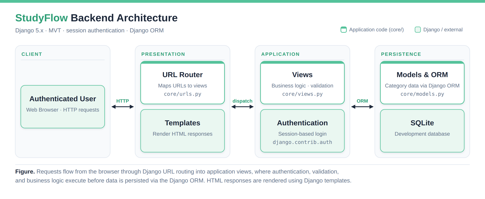
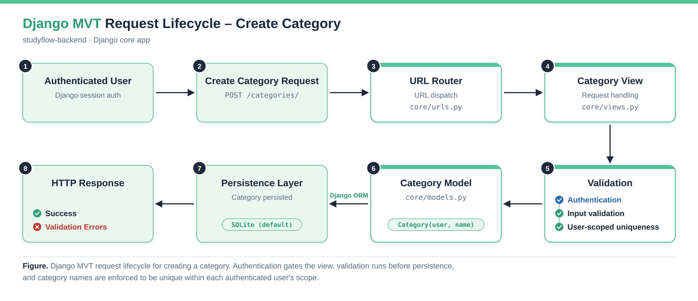

# StudyFlow Backend (Django)

A curated backend showcase from StudyFlow, a multi-user task management application: user-scoped data modelling, validation, and request handling with Django MVT.


---

## Overview

StudyFlow is a multi-user task management application built with Django. Authenticated users create and manage their own categories, tasks, and deadlines, and each user's data is isolated from every other user's.

This repository is a curated backend showcase from that larger team project. It focuses on one component, the **Category module**, and shows how I implemented:

- **Data modelling:** Django ORM models with user ownership and constraints
- **URL routing:** URL configuration for category operations
- **Business logic:** view-level request handling scoped to the authenticated user
- **Validation:** rejection of empty and duplicate category names before persistence

---

## What this repository demonstrates

- Django MVT architecture
- User-scoped data modelling
- Authentication-aware request handling
- Validation and business logic
- Separation of routing, views, and models

---

## Architecture

<p align="center">
  
</p>

The application follows Django's MVT pattern. Requests are routed by the URL layer to views in `core/`, which handle authentication, validation, and business logic. Views read and write data through the Django ORM using the models in `core/models.py`, backed by SQLite in development. HTML responses are rendered with Django templates, and users are authenticated with Django's built-in session authentication (`django.contrib.auth`).

---

## Example Request Lifecycle

<p align="center">
  
</p>

Creating a category shows the full path through the backend.

**Routing.** An authenticated user submits a `POST` request to `/categories/`. `core/urls.py` maps the URL to the category creation view.

**View and business logic.** The view in `core/views.py` requires an authenticated user and scopes the operation to that user. Every category it creates belongs to the requesting user.

**Validation.** Before anything is saved, the view rejects empty category names and names the user already has. The check is per user, so two different users can each have a category called "Work".

**Persistence.** Valid input is saved through the `Category` model in `core/models.py` using the Django ORM, with no raw SQL. A database-level `UniqueConstraint` on `(user, name)` backs up the validation.

**Response.** On success the user receives a success response. If validation fails, the validation errors are returned and nothing is written to the database.

---

## Engineering Highlights

**Backend architecture.** Schema and constraints live in `core/models.py`, request handling and business logic in `core/views.py`, and routing in `core/urls.py`. Each concern sits in its own module. This keeps a change to one concern from spreading into the others.

**Validation strategy.** Input is validated in the view before anything is persisted. Empty and duplicate names are rejected consistently, and the failing input is never written. The database constraint acts as a second line of defence.

**Data modelling.** `Category` has a foreign key to the owning user and a name limited to 100 characters. A `UniqueConstraint` on `(user, name)` scopes uniqueness to each user instead of the whole system, so two users can each have a category called "Work".

**User isolation.** Views require login, and category queries are filtered by the authenticated user. One user cannot read or modify another user's categories. The isolation is enforced in backend queries, not in the interface.

**Category management.** The module implements create, read, update, and delete flows for categories. Categories are sorted case-insensitively using Django query functions.

---

## Repository Structure

```text
studyflow-backend/
├── assets/
├── core/
│   ├── models.py
│   ├── urls.py
│   └── views.py
├── NOTES.md
├── README.md
└── requirements.txt
```

| Component | Responsibility |
|-----------|----------------|
| `core/models.py` | Django ORM models, relationships, and constraints |
| `core/views.py` | Business logic, validation, and request handling |
| `core/urls.py` | URL routing for category operations |
| `requirements.txt` | Python dependencies |
| `NOTES.md` | Additional project notes |
| `assets/` | Architecture diagrams used in this README |

A suggested reading order is `core/urls.py`, then `core/views.py`, then `core/models.py`, which follows the request path shown above.

---

## Tech Stack

- Python
- Django 5.x (MVT)
- Django ORM
- SQLite (development)
- Session authentication
- Git / GitHub

---

## Project Context

StudyFlow was developed as a university team project. The full application includes additional modules owned by my teammates, such as tasks, the dashboard, subtasks, and resources, along with the project settings and the template layer shown in the architecture diagram.

This repository intentionally focuses on my backend contribution: the models, request handling, and validation of the Category module, for which I was primarily responsible. It is organised for portfolio purposes and does not include a runnable configuration.

Full team project repository: [itech-groupBR/tech-group-project](https://github.com/itech-groupBR/tech-group-project)
